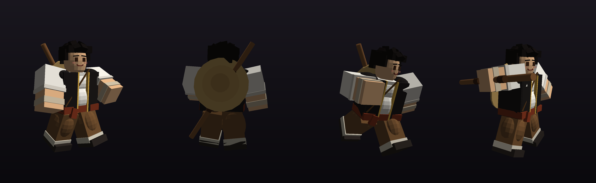
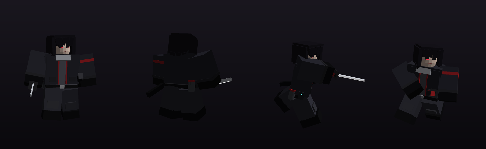

# 금빛과 재 — WACA 배틀그라운드

로블록스 **가장 강한 전장(The Strongest Battlegrounds)** · **주술 시네니건(Jujutsu Shenanigans)** 스타일의 전투 게임입니다.
노션 「WACA // 기밀 인물 도감」에 있는 자캐 두 명을 플레이어블 캐릭터로 만들었습니다.

| | 린 위안 (WACA-21) | 칸자키 렌 (WACA-4) |
|---|---|---|
| 이명 | 금빛 귀환자 | 애시마크 · 회흔 |
| 스타일 | 봉술·장법, 버티고 흘려보내는 무예 | 발도술 + 회분 자원 관리, 원거리 참격 |
| 1 | 기형 · 금장 — 거대한 금빛 손바닥 | 무염박리 — 파고들며 발도, 회분 +2 |
| 2 | 유전 — 근접 공격·투사체를 받아 되돌림 | 회류반송 — 회분(최대 3) 소모 직선 참격 |
| 3 | 봉술 · 회천 — 3회전 휩쓸기, 띄우기 | 측면삭 — 지면을 스치는 참격, 넘어뜨림 |
| 4 | 천 번의 반죽 — 연타 후 목봉 마무리 | 회막 — 검은 분진막으로 시야 차단 |
| 각성 (G) | **심기체일 — 용의 전사**: 황금 용 외체 | **무염재단 · 전력 발도**: 회분 무한 |
| 각성 기술 | 용조 / 용권선 / 승룡 / 황금 용의 귀환 | 연속 반송 / 절단선 / 회막·사냥 / 10단위 최대 출력 |
| 대가 | 권능 종료 후 탈진 (영력 사용 불가) | 최대 출력 후 폐포 손상 (이능 사용 불가) |




*(게임 속 모델을 그대로 렌더링한 미리보기. 실제 게임에서는 노을 조명과 이펙트가 더해집니다.)*

프로필의 능력 원리·한계·대가(예: 렌은 칼로 벤 **비생체 물질**만 회분으로 바꿀 수 있고, 참격은 **직선으로만** 날아감 / 린의 《유전》은 **한 번에 하나의 힘**만 흘림, 권능 뒤 **탈진**)를 게임 규칙으로 옮겼습니다.
렌은 설정상 권능이 미각성이라, 각성은 “게임용 전력 모드”로 따로 만들었습니다. 그리고 로블록스 커뮤니티 규칙(담배 묘사 금지) 때문에 렌의 담배는 모델에서 뺐습니다.

---

## 바로 해 보기 (Roblox Studio)

1. `build/GoldAndAsh.rbxl` 을 Roblox Studio 로 엽니다.
2. ▶ **플레이**를 누르면 캐릭터 선택 화면이 나옵니다.
3. 혼자라면 왼쪽 위 **봇 소환** 버튼으로 상대를 부르거나, 광장 북쪽의 **훈련용 허수아비**(가운데 허수아비는 항상 막기)를 때려 보세요.

> 게임 설정 → 아바타에서 따로 바꿀 것은 없습니다. 캐릭터는 스크립트가 파트로 직접 조립합니다.

### 조작법

| 입력 | 동작 |
|---|---|
| 좌클릭 (누르고 있기) | M1 4연타. 4타에서 Space를 누른 채면 **띄우기**, 공중이면 **내려찍기** |
| F (누르고 있기) | 막기. 맞기 직전(0.16초 안)에 누르면 **패리** |
| Q + WASD | 대시 (앞/뒤/좌/우). 린 위안의 앞 대시는 구르기 |
| 스턴 중 Q | 회피 (회피 게이지 100%일 때) |
| 1 ~ 4 | 기술 |
| G | 각성 (각성 게이지 100%) |
| Shift | 시점 고정 |
| H | 조작법 창 |

게임패드(R2 공격, L2 막기, B 대시, Y 각성, 방향패드 기술)와 모바일(화면 버튼, 기술 칸 터치)도 지원합니다.

---

## 사운드 넣기 (선택이지만 강력 추천)

효과음 39개와 배경음악 4곡을 전부 직접 합성해서 `assets/sounds/` 에 넣어 두었습니다.
로블록스는 외부 오디오를 쓰려면 **업로드**가 필요해서, 업로드 전에는 로블록스 내장 소리로 대신 재생됩니다.

효과음은 **파일 하나(`sfx_sprite.ogg`)에 전부 이어 붙인 "사운드 스프라이트"** 입니다. 게임이 구간을 잘라서 재생하기 때문에, 업로드는 **총 5개**면 됩니다. (인증 안 된 계정의 월 업로드 한도 대응)

- 방법 A — Studio: `보기 → 에셋 관리자` 에서 `sfx_sprite.ogg`, `music_*.ogg` 4개를 가져오기 → 각 에셋 ID를 복사해 `src/shared/SoundIds.luau`(Studio에서는 `ReplicatedStorage.Shared.SoundIds`)에 붙여넣기
- 방법 B — 자동: [Open Cloud API 키](https://create.roblox.com/dashboard/credentials)를 만든 뒤
  `python tools/upload_sounds.py --api-key <키> --user-id <내 유저ID>` → `SoundIds.luau` 가 자동으로 채워집니다.

자세한 설명은 `assets/sounds/README.md` 에 있습니다.

---

## 폴더 구조

```
GoldAndAsh/
├─ build/GoldAndAsh.rbxl        ← Studio 에서 여는 완성 파일 (맵 포함)
├─ default.project.json         ← Rojo 프로젝트
├─ src/
│  ├─ shared/   (ReplicatedStorage.Shared)
│  │  ├─ Config.luau            ← 밸런스 숫자 (피해량, 쿨타임, 속도…)
│  │  ├─ CharacterDefs.luau     ← 캐릭터 소개·기술 이름·설명
│  │  ├─ RigBuilder.luau        ← 캐릭터 외형 (머리·옷·목봉·카타나·칼집 봉인선)
│  │  ├─ Animations.luau        ← 키프레임 애니메이션 48개
│  │  ├─ Sounds.luau / SoundManifest.luau / SoundIds.luau
│  │  └─ Remotes.luau
│  ├─ server/   (ServerScriptService.Server)
│  │  ├─ Combat.luau            ← 피격·막기·패리·가드브레이크·스턴·넉백·래그돌·각성·투사체
│  │  ├─ Actions.luau           ← M1, 막기, 대시/회피, 각성, 기술 슬롯
│  │  ├─ Moves/LinYuan.luau     ← 린 위안 기술
│  │  ├─ Moves/KanzakiRen.luau  ← 칸자키 렌 기술 (회분, 분진막)
│  │  ├─ MapBuilder.luau        ← 맵 (전부 파트로 생성)
│  │  ├─ MapService.luau        ← 스폰, 부서지는 소품
│  │  ├─ CharacterService.luau  ← 선택·부활·허수아비
│  │  └─ Bot.luau               ← 전투 봇 AI
│  └─ client/   (StarterPlayerScripts.Client)
│     ├─ Animator.luau          ← 절차적 애니메이터 (Motor6D.Transform)
│     ├─ VFX.luau               ← 이펙트 (황금 용, 회분 참격, 파편, 충격파…)
│     ├─ CameraFX.luau          ← 화면 흔들림, 임팩트 프레임
│     ├─ UI.luau                ← 선택 화면(3D 미리보기), HUD
│     └─ Input.luau
├─ assets/sounds/               ← 합성한 효과음·음악 (.ogg)
└─ tools/
   ├─ gen_sounds.py             ← 사운드 합성기 (다시 돌리면 같은 결과)
   ├─ upload_sounds.py          ← Open Cloud 업로더
   ├─ build_place.luau          ← 맵을 구워 넣어 .rbxl 만들기 (Lune)
   └─ preview_map.luau          ← 맵 검증 (Lune)
```

### 어떻게 만들었나

- **애니메이션**: 로블록스 애니메이션 에셋은 업로드해야만 쓸 수 있어서, 대신 모든 클라이언트가 각 캐릭터의 관절(`Motor6D.Transform`)을 매 프레임 계산하는 **절차적 애니메이터**를 만들었습니다. 기본자세·달리기·공중 자세 위에 공격 모션을 섞고, 360° 회전 같은 동작도 풀리지 않게 보간합니다.
- **맵**: 「붕괴된 야시장 — WACA 사건 현장」. 가운데 석조 대련장, 북쪽 **林記麵館(린 씨네 국숫집)**, 남쪽 WACA 현장 정리 구역, 동쪽 거리, 서쪽 운하와 돌다리, 둘레의 고층 빌딩 스카이라인. 노을 조명. 상자·통·잔해는 **부서지고**, 렌이 칼로 베면 **검은 재로 무너지며 회분이 쌓입니다**.
- **이펙트**: 텍스처/메시 업로드 없이 파트·파티클·빛으로 만든 황금 용(마디 + 머리), 금빛 손바닥, 회분 초승달 참격, 분진막, 봉인선 점등 등.

### Rojo 로 계속 개발하기

```bash
rojo serve                      # Studio 의 Rojo 플러그인으로 연결해 실시간 동기화
rojo build default.project.json -o build/scripts_only.rbxl
lune run tools/build_place.luau # → build/GoldAndAsh.rbxl
```

`Config.luau` 의 `DebugHitboxes = true` 로 바꾸면 서버 판정 상자가 빨갛게 보입니다.
