# 주술회전 — 영역의 최강 (Jujutsu Kaisen: Domain of the Strongest)

마인크래프트 **Java 1.20.1 / Forge 47.x** 용 주술회전 모드입니다.
캐릭터 4명 — **고죠 사토루 · 료멘 스쿠나 · 하카리 킨지 · 팔악검 이계신장 마허라** — 와 그들의 술식, 영역전개, 흑섬, 반전술식, 마허라의 적응까지
원작(아쿠타미 게게) 설정을 최대한 따라 구현했습니다.

> 설치: `jujutsukaisen-1.20.1-1.0.0.jar` 를 `.minecraft/mods` 폴더에 넣고 Forge 1.20.1(47.x) 프로필로 실행하세요.
> 바로 쓸 수 있는 jar 는 [`dist/`](dist/) 에 있습니다 — CI 가 서버 스모크 테스트와 플레이어 술식 테스트를 통과한 빌드만 여기에 올립니다.

## 인게임 스크린샷
CI 가 실제 클라이언트를 띄워 자동으로 찍은 화면입니다 (`docs/screenshots/`).

| | |
|---|---|
| 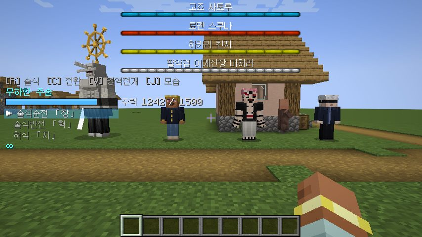 | 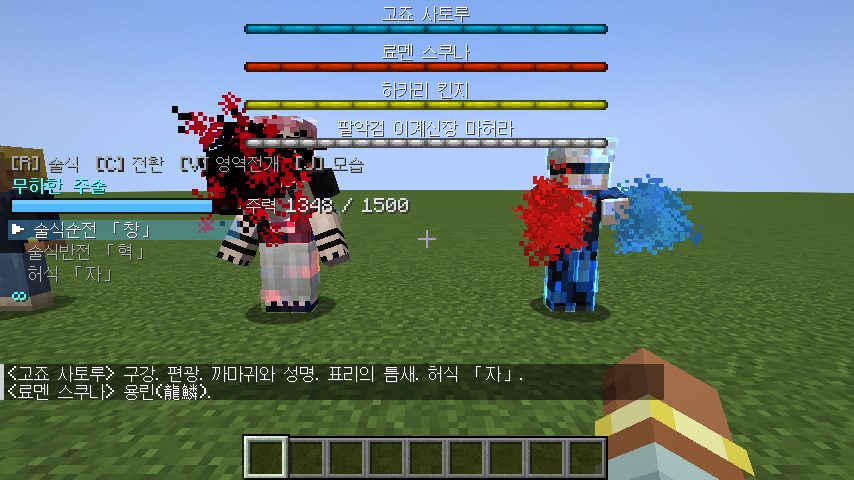 |
| 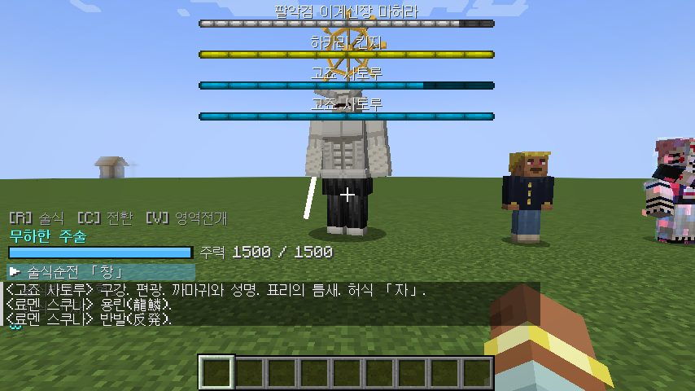 | 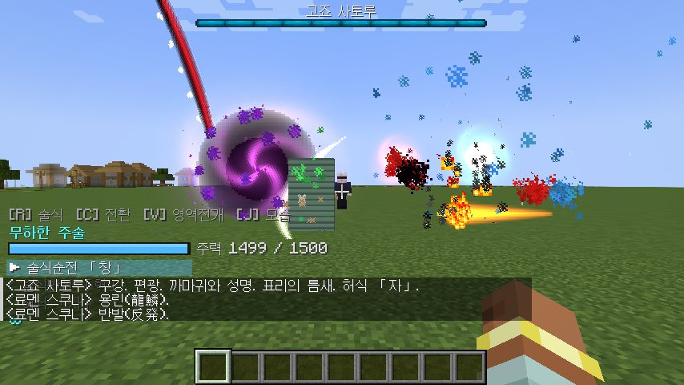 |
| 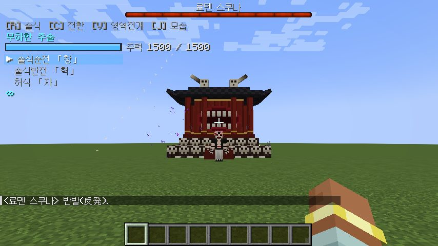 | 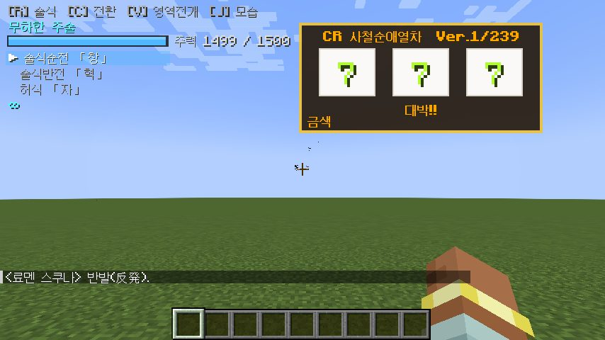 |
| 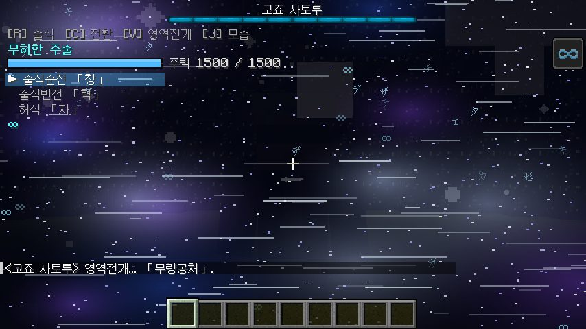 | 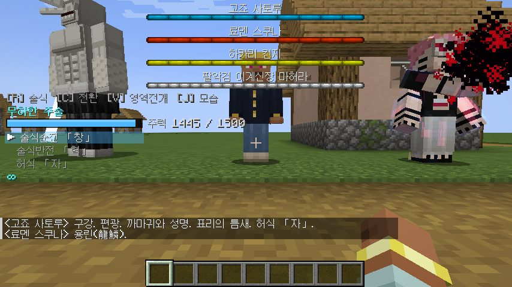 |
| 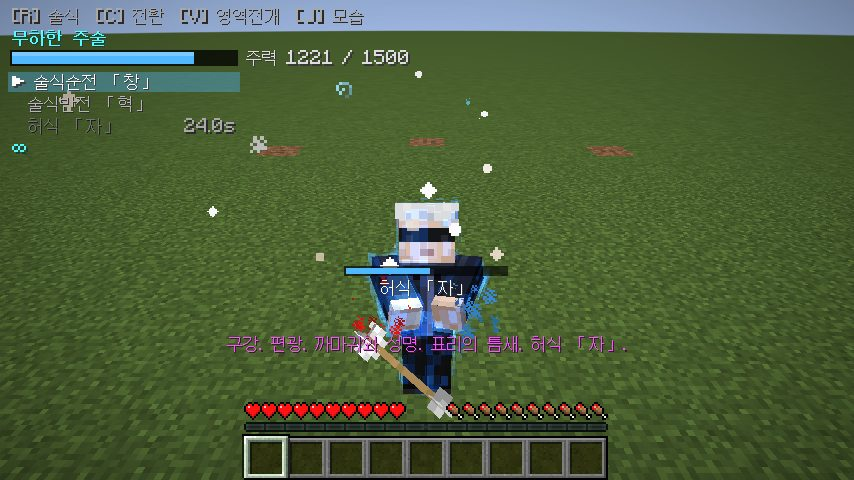 | 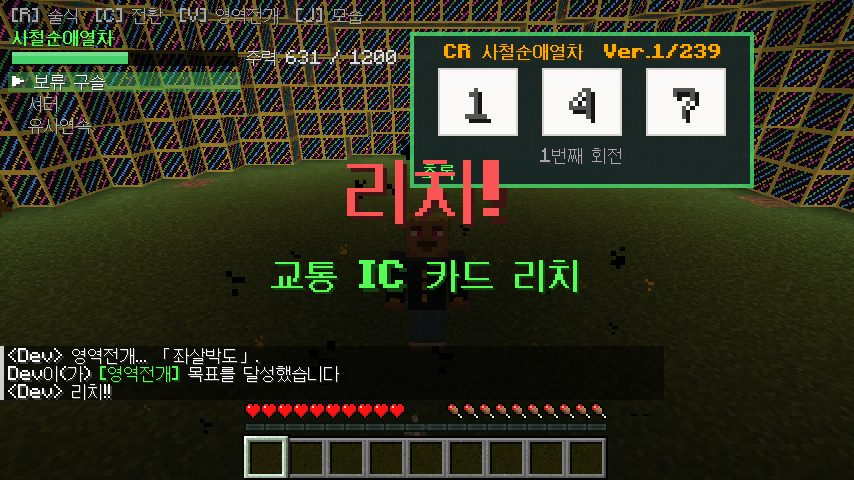 |
| 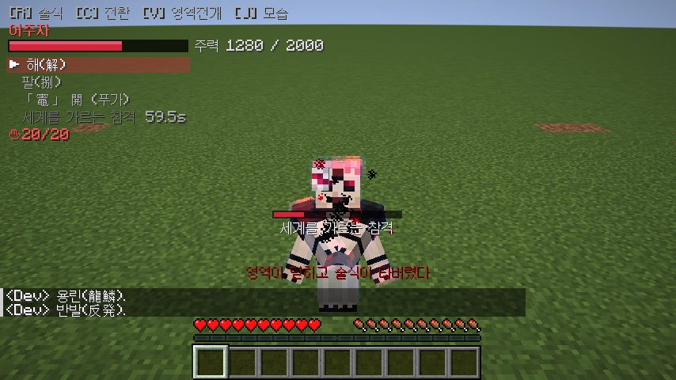 | 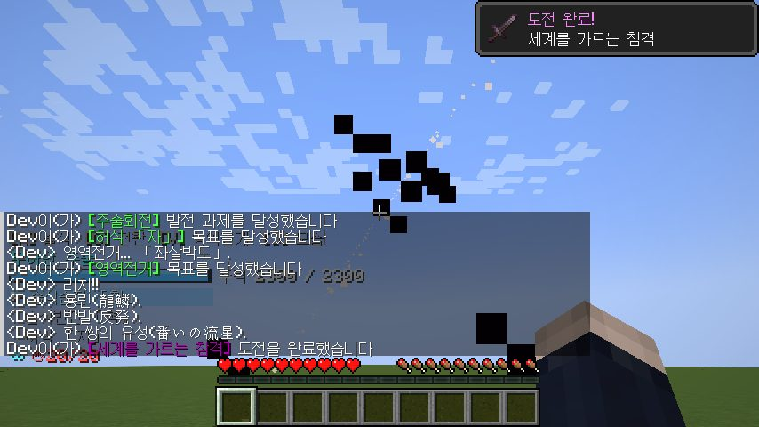 |

---

## 조작 (키는 설정 → 조작에서 변경 가능)

| 키 | 동작 |
|---|---|
| **R** | 선택한 술식 사용 |
| **C** (Shift+C 이전) | 술식 전환 |
| **V** | 영역전개 (전개 중 다시 누르면 해제) |
| **G** (누르고 있기) | 반전술식 — 주력을 소모해 회복, 타버린 술식을 3배 빨리 복구 |
| **H** | 무한 켜기/끄기 (무하한 주술 전용) |
| **J** | 캐릭터 모습 켜기/끄기 (고죠·하카리·스쿠나) |

화면 왼쪽 아래에 **주력 게이지**, 술식 목록·재사용 대기시간, 상태(∞ 무한, ✚ 반전술식, ◆ 존, ✋ 손가락 수, ☸ 마허라 조복)가 표시됩니다.

---

## 캐릭터

### 고죠 사토루 (고죠 사토루) — `옥문강` 을 열면 풀려납니다
* **육안 + 무하한 주술**. **무한**이 항상 켜져 있어 모든 공격·투사체가 닿지 못하고, 날아오는 화살은 허공에서 멈춥니다 (제논의 역설).
* **술식순전 「창」** — 끌어당기는 점, **술식반전 「혁」** — 반발, **허식 「자」** — 지나간 자리의 모든 것을 지우는 가상의 질량.
* **영역전개 「무량공처」** — 결계 안의 모두에게 무한한 정보를 주입해 행동 불능으로 만듭니다 (고죠에게 닿아 있으면 예외).
* 반전술식으로 뇌를 복구하므로 영역 후 술식이 타버리는 시간이 짧습니다 — **그 짧은 틈**이 공략 포인트.
* 중립: 먼저 건드리지 않으면 플레이어를 공격하지 않고, 스쿠나와 적대 몹을 퇴치합니다.
* 대사: 「괜찮아. 난 최강이니까.」 「천상천하 유아독존.」
* 드롭: **술식 각인: 무하한 주술**, **고죠의 안대**

### 료멘 스쿠나 — `스쿠나의 손가락` 을 주민에게 먹이면 수육합니다
* 헤이안 시대의 진짜 모습: **팔 4개, 눈 4개(두 번째 얼굴), 배의 입**, 흑색 문신, 검은 하오리.
* **해(解)** — 보이지 않는 연속 참격 (거리가 멀수록 약해짐), **팔(捌)** — 대상의 강도와 주력에 맞춰 한 번에 베어냄 (영역 밖에선 **접촉 필요**).
* **「竈」 開 (푸가)** — 화살처럼 당겨 쏘는 신의 불꽃. 원작대로 **「해」와 「팔」을 모두 맞힌 뒤에만**(또는 복마어주자 전후에만) 쓸 수 있습니다.
* **영역전개 「복마어주자」** — **결계가 없는** 영역. 범위 안에서 주력이 없는 것(블록)은 「해」가, 주력이 있는 것(생물)은 「팔」이 끝없이 베어 가루로 만듭니다. 결계가 없어 **도망칠 수는 있습니다.**
* **세계를 가르는 참격** — 「용린, 반발, 한 쌍의 유성」 영창 후 공간 자체를 베어 **무한조차 관통**합니다.
* 체력이 떨어지면 반전술식으로 회복하고, 신주쿠에서처럼 **길들인 마허라를 소환**합니다.
* 대사: 「네 주제를 알아라, 멍청한 놈.」 「자랑스러워해라. 너는 강하다.」
* 드롭: **스쿠나의 손가락** 2~4개

### 하카리 킨지 — `지하 격투장 초대장` 을 쓰면 결투를 신청해 옵니다
* **사철순애열차** — 예고 연출을 공격으로 씁니다: **셔터**(문이 대상을 끼워 버림), **보류 구슬**(까칠까칠한 주력의 파친코 구슬), **유사연속**(방어: 받은 피해를 되돌림).
* 예고 색: **초록 < 빨강 < 금색, 무지개 = 확정**. 색이 좋을수록 위력과 리치 기대도가 오릅니다.
* **영역전개 「좌살박도」 (CR 사철순애열차 Ver.1/239)** — 필중은 피해가 아니라 **규칙의 전달**. 예고를 쓰면 **리치**가 걸리고
  (교통 IC 카드 ★ / 좌석 쟁탈 ★★ / 화장실 참기 ★★ / 불금 막차 ★★★) 화면에 릴이 돌며, **세 숫자가 맞으면 대박**.
* **대박** — 정확히 **4분 11초** 동안 주력 무한 + 몸이 **자동으로 반전술식**을 돌려 사실상 불사. 홀수 대박 후엔 **확변**, 짝수 대박 후엔 **시단**(빠른 회전). 유사연속 4연속이면 대박 확정.
* 대사: 「난 「열기」를 사랑한다!」
* 드롭: **술식 각인: 사철순애열차**, 파친코 구슬, (50%) 초대장

### 팔악검 이계신장 마허라 — `십종영법술 부적` 「후루베 유라유라」
* 십종영법술 최강의 식신. 머리 위 **팔악검의 법진**이 「덜컹」 하고 한 칸 돌 때마다 받은 현상에 **적응**합니다.
  * 적응은 기술 이름이 아니라 **현상의 성질** 단위 (참격·화염·폭발·타격·투사체…): 「해」에 적응하면 「팔」에도 내성이 생깁니다.
  * 한 칸 돌 때마다 내성 증가 + **그 현상으로 받은 상처 회복**. 4칸이면 완전 적응(면역).
  * **무한**에 4칸 적응하면 공격이 접촉 순간 무한을 무효화하고, 한 칸 더 돌면 **공간 자체를 베기** 시작합니다.
  * **무량공처**에도 적응하면 퇴마의 검으로 결계를 깨부숩니다.
* 오른팔의 **퇴마의 검** — 정의 에너지. 저주령·언데드에게 막대한 피해.
* **조복의 의식**: 부적을 쓰면 주변 모두가 의식에 끌려 들어가고, 마허라는 **소환자를 포함한 전원**을 공격합니다.
  **혼자서, 자신의 손으로** 쓰러뜨리면 조복 성공 → 이후 부적으로 **주력 400**에 아군으로 소환(90초).
  다른 사람이 돕거나 마무리하면 의식은 **무효**. 길들인 마허라가 파괴되면 식신을 잃습니다 (설정에서 변경 가능).
* 드롭: **퇴마의 검**, **마허라의 법진**

---

## 플레이어가 술식을 얻는 방법
* **스쿠나의 손가락** 먹기 → 그릇이 되어 **어주자** 획득. 손가락 하나당 최대 주력 증가 (최대 20개). 다른 술식을 가진 사람에겐 **맹독**.
  손가락은 고대 도시·요새·보루·삼림 대저택·엔드 시티 등의 상자에서 낮은 확률로 발견됩니다.
* **술식 각인** (보스 드롭) 사용 → 무하한 주술 / 사철순애열차.
* **세계를 가르는 참격**은 마허라를 조복하거나(원작에서 스쿠나는 마허라의 무한 적응을 보고 이 참격을 익혔습니다) 손가락 20개를 모으면 해금됩니다.
* **마허라의 법진**을 보조 손에 들면 원작의 스쿠나처럼 **법진을 짊어지고** 받은 피해에 적응합니다 (머리 위에 법진이 떠오름).

### 고죠 · 하카리 · 스쿠나가 되기
술식을 얻으면 해당 캐릭터의 **모습**(스킨, 스쿠나는 팔 4개·얼굴 문양)과 **술식 포즈**까지 그대로 쓰게 됩니다.
* **술식 각인**을 쓰면 술식과 함께 그 캐릭터의 모습이 됩니다. **J** 키로 원래 모습과 오갈 수 있습니다.
* 스쿠나의 손가락으로 어주자를 얻었다면 **J** 를 눌러 스쿠나의 모습이 될 수 있습니다.
* 크리에이티브/테스트용: `/jjk become @s satoru_gojo` (`kinji_hakari`, `ryomen_sukuna`, `none`) — 술식·모습·주력을 한 번에 설정합니다.
* 1인칭에서도 손이 캐릭터의 손으로 보이고, 고죠는 무한이 화살·투사체를 멈춰 세웁니다.

## 공통 시스템
* **주력(呪力)** — 술식·영역·반전술식의 자원. 시간이 지나면 회복 (육안 보유자는 더 빠름).
* **흑섬(黒閃)** — 주력을 실은 풀 차지 근접 공격이 낮은 확률로 흑섬이 됩니다 (의도적으로는 불가능). 피해 2.5배, 이후 **존(ゾーン)** 상태로 다음 흑섬 확률 상승.
  *원작은 「위력의 2.5제곱」이지만 게임 밸런스를 위해 2.5배로 적용 (설정 변경 가능).*
* **영역전개** — 필중 효과. 두 영역이 겹치면 **영역 싸움**: 더 정교한(술식·주력·숙련도) 쪽이 상대를 밀어냅니다.
* **술식 타버림** — 영역이 닫히면 한동안 술식을 쓸 수 없습니다. 반전술식으로 뇌를 복구하면 3배 빨리 회복. 대박은 즉시 회복.
* **반전술식** — 고죠·스쿠나(어주자) 계열만 수동 사용. 하카리는 대박 중에만 자동 발동.

## 제작법
| 아이템 | 재료 |
|---|---|
| 십종영법술 부적 | 철 검 8 (둘레) + 메아리 조각 (가운데) — "팔악검" |
| 옥문강 | 우는 흑요석 4 (모서리) + 엔더의 눈 4 + 다이아몬드 블록 |
| 하카리의 지하 격투장 초대장 | 종이 + 금 주괴 + 철 주괴 (무형) |
| 파친코 구슬 ×8 | 철 주괴 |
| 고죠의 안대 | 검은색 양털 5 (투구 모양) |

## 명령어 (OP)
```
/jjk become <플레이어> <satoru_gojo|kinji_hakari|ryomen_sukuna|none>
/jjk technique <플레이어> <none|limitless|shrine|idle_death_gamble>
/jjk energy <플레이어> <양>
/jjk fingers <플레이어> <0~20>
/jjk tame_mahoraga <플레이어>
/jjk jackpot <플레이어>
/jjk reset <플레이어>
/jjk info [플레이어]
```

## 설정 (`config/jujutsukaisen-common.toml`)
지형 파괴(술식/영역/허식 자), 복마어주자 범위(기본 26블록, 원작 최대 약 200m)·초당 파괴량, 무량공처/좌살박도 반경, 영역 지속시간,
플레이어 술식 타버림 시간, 흑섬 확률·배율, 길들인 마허라 상실 여부를 조절할 수 있습니다. 몹의 지형 파괴는 `mobGriefing` 게임룰도 따릅니다.

---

## 개발
* 소스: `src/main/java/com/jujutsukaisen`
* 텍스처·언어 파일·데이터팩은 `tools/` 의 파이썬 스크립트로 생성됩니다 (`python3 tools/gen_textures.py`, `gen_lang.py`, `gen_data.py`, Pillow 필요).
* 빌드: `./gradlew build` (JDK 17) → `build/libs/`
* CI 는 빌드 후 **헤드리스 서버 스모크 테스트**(네 캐릭터 소환·전투, 모든 술식과 영역전개를 1회씩 강제 발동, 데이터팩 검증)와
  **클라이언트 스크린샷 테스트**(xvfb + Mesa 로 실제 게임을 실행해 장면을 촬영),
  **플레이어 술식 테스트**(플레이어가 고죠·하카리·스쿠나가 되어 키 입력 경로로 술식을 실제로 쓰는지 확인)를 실행하고,
  모두 통과하면 jar 를 `dist/` 에 커밋합니다.
  `ci/smoketest.enabled`, `ci/screenshots.enabled` 파일을 지우면 각각 꺼집니다.

*주술회전(呪術廻戦)은 아쿠타미 게게의 작품입니다. 이 모드는 비공식 팬메이드입니다.*
